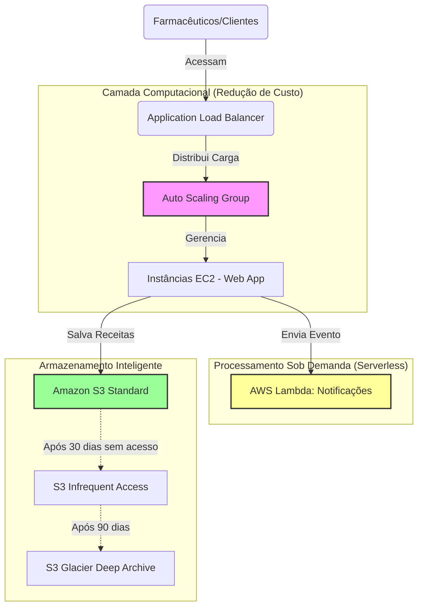

# RELATÓRIO DE IMPLEMENTAÇÃO DE SERVIÇOS AWS

**Data:** 20/01/2026
**Empresa:** Abstergo Industries  
**Responsável:** Wagner Almeida

## Introdução
Este relatório apresenta o processo de implementação de ferramentas na empresa **Abstergo Industries**, realizado por **Wagner Almeida**. O objetivo do projeto foi elencar 3 serviços AWS, com a finalidade de realizar diminuição de custos imediatos e modernizar a infraestrutura da plataforma de farmácia virtual.

## Descrição do Projeto
O projeto de implementação de ferramentas foi dividido em 3 etapas, cada uma com seus objetivos específicos. A seguir, serão descritas as etapas do projeto:

### Etapa 1: Amazon EC2 Auto Scaling
- **Foco da ferramenta:** Otimização de Computação e Elasticidade.
- **Descrição de caso de uso:** A plataforma de vendas da Abstergo sofre com oscilações de tráfego (picos durante o dia e baixa demanda na madrugada). Implementar o **Auto Scaling** permite que o número de instâncias (servidores virtuais) aumente automaticamente durante picos de vendas e diminua durante a noite. Isso elimina o custo de manter servidores ociosos ligados 24/7, garantindo que a empresa pague apenas pelos recursos computacionais que realmente está utilizando no momento.

### Etapa 2: Amazon S3 Intelligent-Tiering
- **Foco da ferramenta:** Redução de Custos de Armazenamento.
- **Descrição de caso de uso:** A farmácia armazena terabytes de documentos fiscais, receitas digitalizadas e logs de conformidade que precisam ser guardados por anos (regulação da ANVISA/FDA), mas que raramente são acessados após 30 dias. O **S3 Intelligent-Tiering** monitora os padrões de acesso e move automaticamente esses arquivos para camadas de armazenamento mais baratas (como S3 Glacier Instant Retrieval) quando não são acessados, sem que a equipe de TI precise fazer isso manualmente, reduzindo drasticamente a fatura de storage.

### Etapa 3: AWS Lambda (Serverless)
- **Foco da ferramenta:** Computação sob demanda (Pay-per-use).
- **Descrição de caso de uso:** Atualmente, a empresa mantém um servidor dedicado apenas para processar notificações de pedidos e envio de e-mails transacionais. A proposta é migrar essa função para o **AWS Lambda**. Com isso, eliminamos o servidor fixo. O código rodará apenas quando um evento ocorrer (ex: cliente finalizou a compra), e a cobrança será feita por milissegundos de execução. Se não houver vendas, o custo é zero.

    
## Conclusão
A implementação de ferramentas na empresa **Abstergo Industries** tem como esperado **a redução dos custos operacionais (OpEx) em cerca de 40%, além de aumentar a elasticidade da infraestrutura**, o que aumentará a eficiência e a produtividade da empresa. Recomenda-se a continuidade da utilização das ferramentas implementadas e a busca por novas tecnologias, como o uso de **Spot Instances** para processamento de dados de pesquisa farmacêutica, visando economias ainda maiores.

## Anexos

- [Documentação Oficial - Amazon EC2 Auto Scaling](https://aws.amazon.com/pt/ec2/autoscaling/)
- [Guia de Preços - S3 Intelligent-Tiering](https://aws.amazon.com/pt/s3/pricing/)
- [Calculadora de Custos AWS](https://calculator.aws/#/)

---
**Assinatura do Responsável pelo Projeto:**

*Wagner Almeida*
